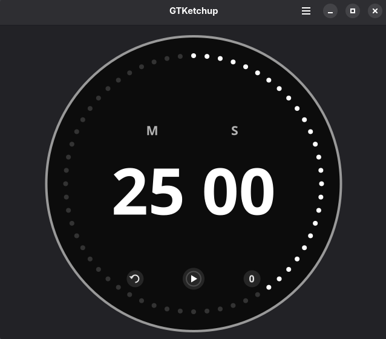

# GTKetchup

Stay focused and increase your productivity with GTKetchup, a native GNOME application built with GTK4 and Libadwaita. It features a beautiful, custom-drawn circular interface that dynamically changes colors the longer you focus. Use the scroll wheel to change the time. Feel the tactile feedback of the timer!

